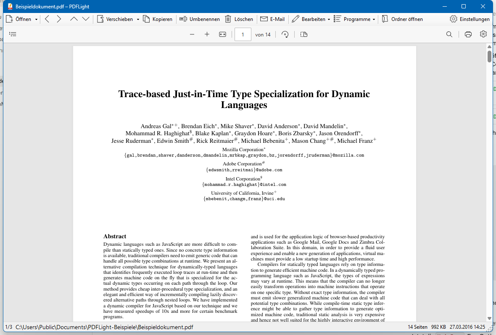

# PDFlight

Schlanker PDF-Betrachter mit Dateiverwaltung für Windows — ansehen, einsortieren, fertig.

PDFlight ist der bewusst abgespeckte Open-Source-Nachfolger von PDFMover. Der Kern-Arbeitsablauf:
eine PDF-Datei öffnen (z. B. einen eingescannten Befund oder eine Rechnung), kurz prüfen und mit
einem Klick in den richtigen Ordner **verschieben** — danach zeigt PDFlight automatisch die nächste
PDF-Datei des Ordners an. Ideal, um volle Eingangs- und Scan-Ordner zügig abzuarbeiten.



## Funktionen

- **Anzeigen**: Chromium-PDF-Viewer (WebView2) mit Zoom, Textsuche, Drucken, Drehen der Ansicht
  und Miniaturansichten. Die angezeigte Datei wird aus dem Speicher geladen und ist dadurch
  **nie gesperrt** — sie kann jederzeit verschoben, umbenannt oder extern bearbeitet werden.
- **Einsortieren**: Verschieben/Kopieren über einen Ordnerdialog mit Explorer-Ordnerbaum,
  Zielordnerliste, Zuletzt-Liste und Verlauf; Schnell-Verschieben in den ersten Zielordner
  per Strg+Klick; nach dem Verschieben wird automatisch die nächste PDF geladen.
- **Umbenennen**: großer Dialog mit der Dateiliste des Ordners als Namensvorlage,
  Umwandeln-Menü (Unterstriche, Bindestriche, Klein-/Titelschreibung, Umlaute ersetzen),
  Datums-Präfixen/-Suffixen und optionalem Zielordnerwechsel.
- **Bearbeiten** (PDFsharp): Seiten löschen (Strg+Entf), Seiten drehen (Strg+R), PDF anhängen,
  Seiten als neue Datei extrahieren, Dokumenteigenschaften (Titel, Autor, Betreff, Stichwörter)
  bearbeiten — mit einstufigem Rückgängig (Strg+Z).
- **Weitergeben**: E-Mail mit der Datei als Anhang über das Standard-Mailprogramm (Strg+E),
  Öffnen in installierten PDF-Programmen (Strg+1 … Strg+9, automatisch erkannt),
  „Öffnen mit“-Dialog, Anzeigen im Explorer.
- **Aufräumen**: Löschen in den Papierkorb (Entf), Blättern durch alle PDFs des Ordners (Alt+←/→).
- Drag & Drop, F11-Vollbild, zentraler Einstellungsdialog, Symbole aus der Windows-Symbolschrift,
  zuletzt geöffnete Dateien im Öffnen-Menü, optional „Programm mit Esc beenden“ und
  „Zuletzt geöffnete Datei beim Start laden“. Laufen mehrere Instanzen gleichzeitig,
  teilen sie sich Ziel- und Zuletzt-Listen.

## Tastenkürzel

| Kürzel | Funktion |
|---|---|
| Strg+O | PDF-Datei öffnen |
| Alt+← / Alt+→ | Vorherige / nächste PDF-Datei im Ordner |
| Bild ↑ / Bild ↓ | Im Dokument blättern |
| Strg+M | Verschieben (Ordnerdialog) |
| Strg+K | Kopieren (Ordnerdialog) |
| F2 | Umbenennen |
| Entf | In den Papierkorb |
| Strg+Entf | Seiten löschen |
| Strg+R | Seiten drehen |
| Strg+Z | Letzte Dokumentänderung rückgängig |
| Strg+I | Dokumenteigenschaften |
| Strg+E | Als E-Mail-Anhang senden |
| Strg+1 … Strg+9 | In externem Programm öffnen |
| F11 / Esc | Vollbild ein / aus |
| Esc | Programm beenden (abschaltbare Option) |
| F1 | Über PDFlight (Versionen, Spenden) |

## Voraussetzungen

- Windows 10/11 (64-Bit)
- [.NET Desktop Runtime 10](https://dotnet.microsoft.com/download/dotnet/10.0) —
  fehlt sie, zeigt Windows beim ersten Start selbst einen Download-Hinweis
- [WebView2-Runtime](https://developer.microsoft.com/microsoft-edge/webview2/) —
  auf Windows 10/11 in der Regel bereits vorhanden

## Bauen

Visual Studio 2022 oder neuer mit .NET-10-SDK:

```
dotnet build PDFlight.csproj -c Release
```

Für das Setup zusätzlich [Inno Setup 6](https://jrsoftware.org/isinfo.php): nach dem
Release-Build die Datei `Installer.iss` kompilieren — sie nimmt die Dateien direkt aus
`bin\Release\net10.0-windows` und erzeugt `PDFlightSetup.exe`.

## Technik

- **Anzeige**: nativer WebView2/Chromium-PDF-Viewer. Das Dokument wird über ein virtuelles
  Host-Schema aus dem Speicher serviert (`Classes/PdfViewHost.cs`), Drag & Drop auf den Viewer
  wird über das Abfangen der ausgelösten `file://`-Navigation umgeleitet.
- **Bearbeitung**: [PDFsharp](https://www.pdfsharp.net/) (MIT) — `Classes/PdfEditService.cs`.
- **E-Mail**: SendMail-DropTarget der Windows-Shell (respektiert die „.mapimail“-Zuordnung,
  der von SumatraPDF bekannte Weg), mit Simple-MAPI-Fallback — `Classes/MailSender.cs`.
- **Ordnerbaum**: eigener `FolderTreeView` auf Basis des Standard-TreeView mit Explorer-Icons
  (`SHGetFileInfo`) und natürlicher Sortierung (`StrCmpLogicalW`) — `Controls/`.
- Sämtliches Interop läuft über quellgenerierte P/Invokes (`LibraryImport`) und
  quellgeneriertes COM (`GeneratedComInterface`); keine kommerziellen Abhängigkeiten.
- Einstellungen: `%APPDATA%\PDFlight\settings.json`;
  WebView2-Daten und Undo-Sicherung: `%LOCALAPPDATA%\PDFlight\`.

## Unterstützen

PDFlight ist kostenlos und quelloffen. Wenn es Ihnen die Arbeit erleichtert, freut sich der
Autor über eine [Spende via PayPal](https://www.paypal.com/cgi-bin/webscr?cmd=_s-xclick&hosted_button_id=S8DVXHKFC2CVS&source=url) —
auch direkt aus dem Programm über den Info-Dialog (F1).

## Lizenz

[MIT](LICENSE) — © 2026 Wilhelm Happe.
